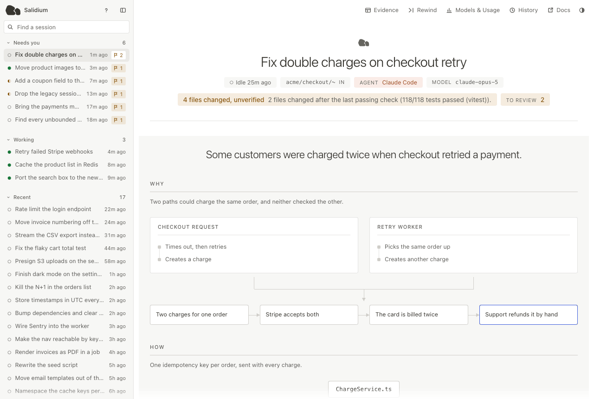
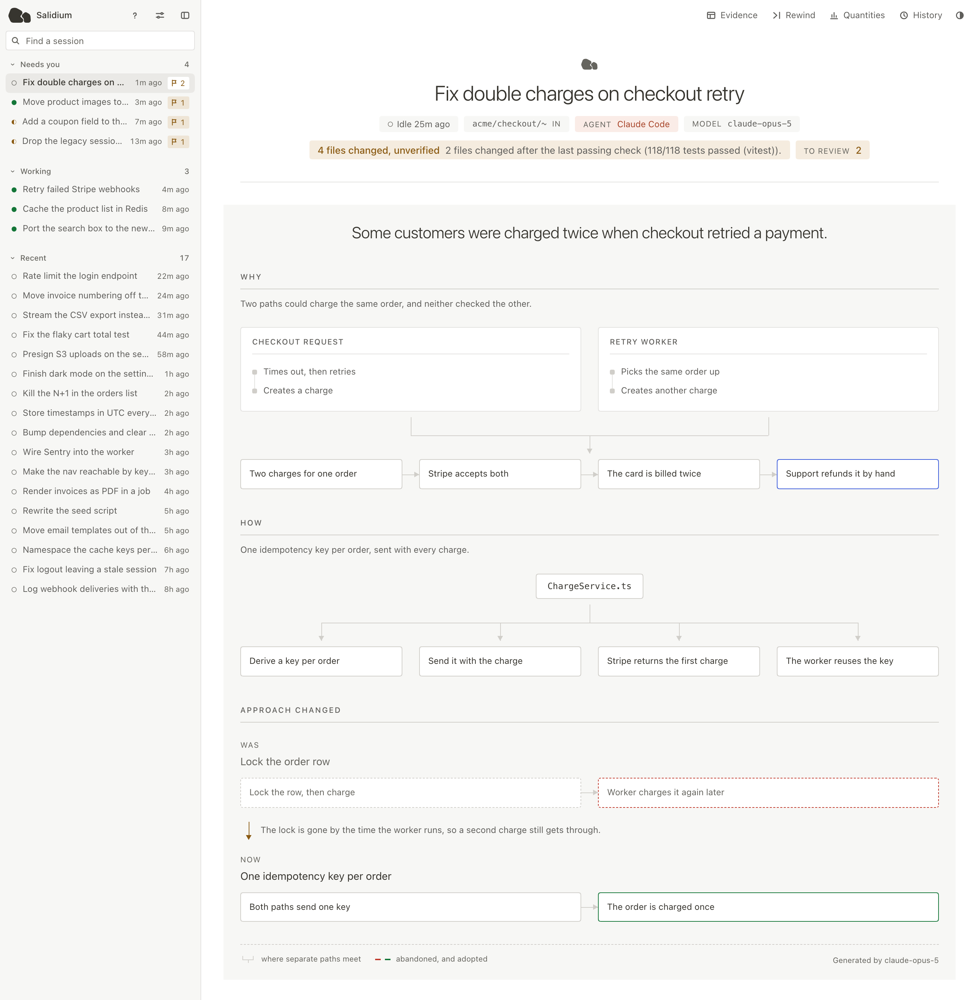

# Salidium

**Visualize your agent's work with diagrams and plain explanations, not walls of text.**

Reading back a Claude Code or Codex run means scrolling the whole transcript. Salidium reads it and
draws what happened.

```bash
npx salidium
```

<picture>
  <source media="(prefers-color-scheme: dark)" srcset="apps/site/public/tour-dark.gif">
  
</picture>

Salidium is [MIT-licensed](LICENSE), open source, and local-first. The report, event store, and
interface run on your machine with no Salidium telemetry. Raw transcripts stay local. Optional
generated explanations send a bounded, redacted excerpt through your installed agent CLI, which
may contact its provider; they can be turned off.

<picture>
  <source media="(prefers-color-scheme: dark)" srcset="apps/site/public/report-dark.png">
  
</picture>

Supported agents: Claude Code and Codex. Node.js 24 or newer is required. On first run Salidium
finds the agents, shows the local settings it wants to update, asks permission, and opens the
interface.

## Documentation

The documentation is at [salidium.com/docs](https://salidium.com/docs).

1. [Install](https://salidium.com/docs/install)
2. [Opening the page](https://salidium.com/docs/the-page)
3. [Sessions](https://salidium.com/docs/sessions)
4. [Reading a report](https://salidium.com/docs/report)
5. [Evidence](https://salidium.com/docs/evidence)
6. [Rewind, History and Quantities](https://salidium.com/docs/rewind)
7. [Records](https://salidium.com/docs/records)
8. [How we know](https://salidium.com/docs/provenance)
9. [Explanations](https://salidium.com/docs/explanations)
10. [What stays on your machine](https://salidium.com/docs/local)
11. [Keyboard](https://salidium.com/docs/keyboard)
12. [CLI](https://salidium.com/docs/cli)
13. [Environment](https://salidium.com/docs/environment)
14. [Limits](https://salidium.com/docs/limits)

In this repository: [Using Salidium](docs/using-salidium.md),
[architecture](docs/architecture.md), the
[open-source and hosted-service boundary](docs/open-source-boundary.md),
[long-term intelligence](docs/long-term-intelligence.md) and its
[evaluation protocol](docs/evaluation-protocol.md), [contributing](CONTRIBUTING.md), and the
[security policy](SECURITY.md).

## Development

```bash
pnpm install --frozen-lockfile
pnpm lint
pnpm typecheck
pnpm test
pnpm build
```

Run from source with `pnpm salidium`. The public CLI is bundled as one self-contained script, and
the separately releasable `@salidium/sync-contract` contains only strict interoperability schemas.
